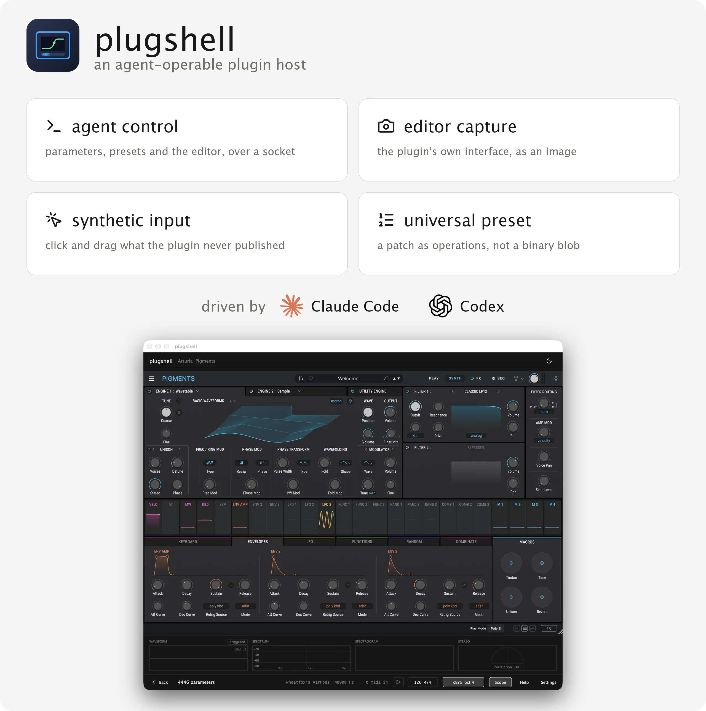
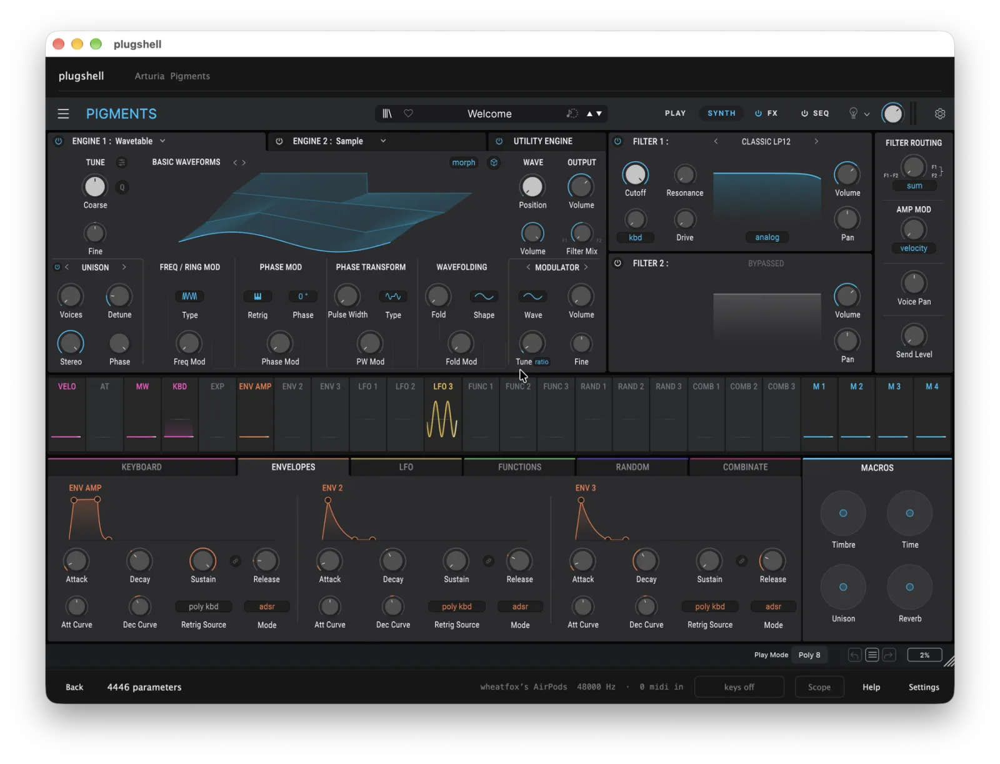

# plugshell



An agent-operable host for audio plugins.

`plugshell` loads VST3 and Audio Unit plugins, exposes their parameters and presets over a machine-readable protocol, and — the part that does not exist today — lets a program **see** the plugin's editor and **operate the controls that are not exposed as parameters**, the way a human would.

It runs two ways: as a standalone macOS application for studying a plugin on its own, and as a plugin itself, so the same interface is available inside a DAW with real signal flowing through it.

> **Status: early, and it runs.** The macOS application loads VST3 plugins, hosts their editors, plays them from the computer keyboard, and shows what the output looks like. **Editor capture and an agent RPC surface are in.** Capture is verified against Pigments and Analog Lab V at full Retina resolution. Synthetic input is implemented but not yet confirmed to reach a plugin, because both capture and input need macOS permissions (Screen Recording and Accessibility) that the app now asks for in Settings. See [Roadmap](#roadmap).

---

## Motivation

Two things are hard to do with an audio plugin today.

**The first is automation beyond the parameter list.** A plugin publishes a set of automatable parameters, and every host can read and write those. But a plugin's editor routinely contains controls that are not in that list: wavetable selection, modulation routings drawn by dragging one control onto another, preset browsers, matrix cells, oscilloscope zoom, anything the developer chose not to expose. If a control is not a parameter, no host can touch it, and any workflow that needs it stops being programmable.

**The second is that a program cannot see the plugin.** Parameter values are numbers without context. Knowing that `osc1_wt_pos = 0.42` says nothing about what the wavetable looks like at that position, whether the filter curve on screen is doing what you intended, or what the modulation matrix currently routes where. The information a person uses to work with a plugin is mostly visual, and none of it is available programmatically.

These two gaps have the same consequence: an automated agent — a language model with tool access, a test harness, a batch analysis script — can adjust the numbers a plugin chooses to publish, and is blind and powerless for everything else.

`plugshell` closes both gaps. It gives a calling program the plugin's parameters, its presets, a rendered image of its editor, and the ability to click and drag inside that editor. What a person can do with a plugin, a program can do.

### What this makes possible

- **Assisted sound design.** An agent can open a synth, look at the editor, change a control, listen to the result, and iterate — including controls that are not parameters.
- **Plugin study and documentation.** Enumerate a plugin's factory banks, load each preset, capture the editor, and build a searchable catalogue of what a library actually contains.
- **Regression testing for plugin developers.** Drive the editor, capture it, and diff the image across builds.
- **Reproducible experiments.** Describe a patch as a sequence of operations rather than an opaque binary state blob.
- **Accessibility.** Custom-drawn plugin editors are invisible to screen readers. A structured description of the editor is a starting point for changing that.

---

## Related work

Plugin hosting is well-trodden. Programmatic hosting is less so. Agent-facing hosting with editor access does not appear to exist.

| Project | Loads VST3/AU | Parameters | Presets | Opens editor | Screenshot | Synthetic input | Agent protocol |
|---|---|---|---|---|---|---|---|
| [pedalboard](https://spotify.github.io/pedalboard/) (Spotify) | yes | yes | no | no | no | no | no |
| [DawDreamer](http://dirt.design/DawDreamer/) | yes | yes | `.fxp`, `.vstpreset` | yes, **blocking** | no | no | no |
| [Carla](https://github.com/falkTX/Carla) | yes | yes | yes | yes | no | no | no |
| [VCV Host](https://vcvrack.com/Host) | yes | yes | — | yes | no | no | no |
| [ableton-mcp-extended](https://github.com/uisato/ableton-mcp-extended) | via Live API | yes | — | no | no | no | yes (MCP) |
| **plugshell** | yes | yes | yes, incl. factory banks | yes, **non-blocking** | yes | yes | yes (MCP) |

**DawDreamer is the closest prior work** and the most useful reference. It has a complete parameter API, loads `.fxp` and `.vstpreset` files, saves and restores plugin state, and can open a plugin's editor. Its editor call is documented as blocking — it "will pause Python execution until you close the editor window" — because it is designed for a human to make an adjustment mid-script. That is the right design for its purpose and the wrong one for an automated caller, which needs the window open, observable, and driveable while it keeps working.

**pedalboard** is excellent for its actual purpose, audio processing in Python, and deliberately has no editor support.

**ableton-mcp-extended** shows the agent-protocol half of this problem being solved through a DAW's own scripting API. That approach inherits whatever the DAW exposes, which does not include the inside of a plugin's editor.

### Adjacent work worth knowing

- **DAW scripting APIs** (Reaper ReaScript, Bitwig's Controller API, the Live Object Model) reach devices and parameters, never editor internals.
- **GUI automation frameworks** (Appium, Playwright, macOS Accessibility) assume an accessibility tree. Audio plugin editors are typically custom-drawn — often through OpenGL or Metal — and expose no such tree, which is why generic tools do not work here and why this project has to solve image capture and event injection directly.
- **Plugin analysis tools** such as Plugin Doctor measure a plugin's transfer characteristics as a black box. Complementary to this work, not overlapping.

### The contribution

Stated plainly: parameter-level plugin hosting is solved. This project adds the editor — capture it, operate it, and put both behind a protocol an agent can call — and packages the result so it works standalone and inside a DAW.

---

## Design

### Components

```
  Agent  (Claude Code, Codex, a test script, anything)
    |
    |  MCP over stdio
    v
  plugshell-mcp        thin protocol adapter
    |
    |  JSON-RPC over local WebSocket
    v
  plugshell-core       C++ / JUCE
    |
    +-- plugin loading         AudioPluginFormatManager (VST3 + AU)
    +-- parameters            AudioProcessorParameter
    +-- presets               VST3 and AU preset APIs, factory banks
    +-- editor surface        capture and event injection
    +-- audio                 offline render and realtime device I/O
```

`plugshell-core` builds into three products from one codebase:

| Product | Use |
|---|---|
| `PlugShell.app` | Standalone. Study a plugin with no DAW running. |
| `PlugShell.vst3` | Loaded in a DAW, hosts a child plugin, same protocol. |
| `PlugShell.component` | Audio Unit build of the same. |

The separate RPC layer exists because of the in-DAW product: a plugin cannot spawn its own agent process, so the agent connects inward. Using the same transport for the standalone app means a caller sees one interface in both modes.

### Why C++ and JUCE

The VST3 SDK is C++, and JUCE is the only mature framework that hosts both VST3 and Audio Units, manages editor windows, and builds application and plugin targets from shared source. Writing the core in C++ also keeps the path to deeper DAW integration open. Higher-level languages would mean a binding layer for exactly the operations that need to be closest to the platform: window capture and event dispatch.

### The two mechanisms that must be proven first

Everything else here is ordinary engineering. These two are not, and the project's feasibility rests on them.

**Editor capture.** A plugin's editor is drawn by the plugin into a host-provided view. Plugins that render through OpenGL or Metal do not necessarily yield their contents to view-level snapshot APIs, which read the view's backing store. Candidate approaches, in order of preference: JUCE's `createSnapshotOfNativeWindow`; `NSView` caching APIs; `ScreenCaptureKit`, which is reliable but requires the Screen Recording permission and a window that is actually on screen.

**Event injection.** Synthesising a mouse event and delivering it to the editor's view is straightforward to attempt and not guaranteed to land. A plugin may run its own event handling, hit-test against GPU state, or ignore events whose provenance it does not recognise. Candidates: synthetic `NSEvent` posted to the view; `CGEvent` at the session level, which is more likely to work and less precise; the plugin framework's own event entry points where they can be identified.

Both are per-plugin behaviours, not per-platform ones. The spike therefore tests against three plugins chosen for different rendering strategies rather than trying to reason about it in the abstract.

### Interface

plugshell owns one horizontal strip along the bottom of the window. Everything else belongs to the plugin, because a host that wraps a plugin in its own chrome competes with the plugin's interface and makes the editor harder to capture cleanly. The window sizes itself to the editor and follows it when a plugin resizes its own.

The strip carries state, the computer-keyboard toggle with the note and chord being played, the scope, and help and settings. See [docs/UI.md](docs/UI.md).



## What works today

- **Lists installed VST3 plugins without running any of them.** Enumerating plugins by loading them is what hosts normally do, and on the development machine it started vendor licensing servers, raised error dialogs, and killed the process. Indexing reads each bundle's `Info.plist` instead.
- **Hosts the editor unmodified**, sizes the window to it, and follows it when the plugin resizes itself.
- **Plays instruments from the computer keyboard**, two octaves, with the chord being played named in the strip. Watched at the platform event layer, because a plugin editor is a native view and takes keyboard focus away from the host the moment it is clicked.
- **Audio out and every MIDI input**, with no input channel requested: on a Bluetooth headset opening the microphone switches the device to the hands-free profile.
- **A waveform and spectrum panel** that slides out of the strip, for seeing what a parameter actually did.

## Documentation

- [docs/BUILD.md](docs/BUILD.md) — requirements, targets, repository layout
- [docs/UNIVERSAL_PRESET.md](docs/UNIVERSAL_PRESET.md) — operations instead of binaries, and the legal reasoning
- [docs/UI.md](docs/UI.md) — interface principle and the control bar
- [docs/SPIKE.md](docs/SPIKE.md) — phase-1 plan and findings
- [CONTRIBUTING.md](CONTRIBUTING.md) — what is useful right now

## Contributing

The project is at design stage, so the most useful contributions right now are:

- Evidence about editor capture or event injection on specific plugins, especially negative results
- Prior art that this survey missed
- Design critique, particularly of the RPC boundary and the in-DAW product

Open an issue before writing code, so effort does not land on a phase that the spike may invalidate.
