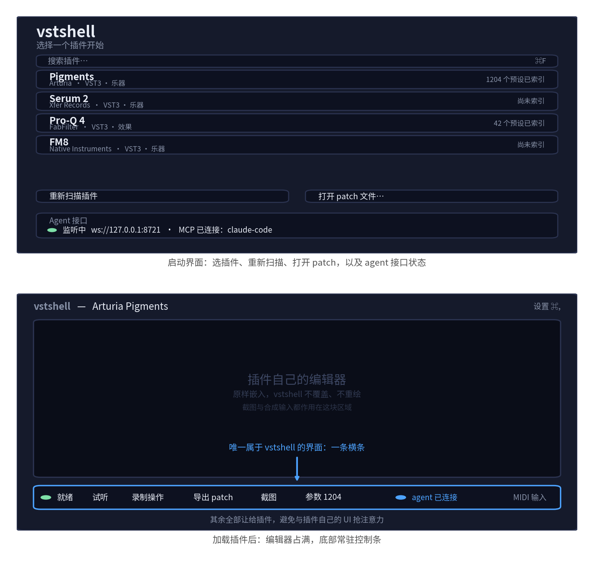

<!-- SPDX-License-Identifier: GPL-3.0-or-later -->

# Interface

## Principle

**vstshell owns one strip.** Everything else on screen belongs to the plugin.

A host that wraps a plugin in its own chrome competes with the plugin's own
interface for attention, and every pixel it spends is a pixel the plugin
designer wanted. It also makes capture harder: the region worth screenshotting
is the plugin's editor, and a host that draws over or around it has to crop
its own furniture back out.

So the layout is deliberately unbalanced. The editor gets the window. vstshell
gets a horizontal bar along the bottom.

## Launch screen

Shown before a plugin is loaded, because an empty host window with nothing in
it is a worse first impression than a list of what is available.

- Search and pick from the scanned plugins
- Each row shows vendor, format, whether it is an instrument or an effect, and
  how many of its presets have been indexed
- Rescan, and open a `.vsp` patch file
- The agent endpoint's state, because a user needs to know whether something
  is connected and what it is

The endpoint row is not decoration. An agent driving this app can change what
is on screen at any moment, and a user who cannot see that a client is
attached will eventually be confused by their own window.

## Loaded

The plugin's editor is embedded at its native size, unmodified. vstshell does
not draw over it, rescale it, or reimplement any part of it. Capture and
synthetic input both target exactly this region, which is also why nothing of
ours may overlap it.

### The control bar

One row, always present:

| Element | Purpose |
|---|---|
| State lamp | idle, rendering, recording, crashed |
| Audition | play the loaded MIDI phrase through the plugin |
| Record operations | start capturing user actions into a patch |
| Export patch | write the recorded operations to `.vsp` |
| Screenshot | capture the editor to a file |
| Parameter count | opens the parameter list |
| Agent indicator | whether a client is attached, and which |
| MIDI input | selected input device |

Recording and the agent indicator are the two that matter most. Recording is
how a universal patch gets authored — see [UNIVERSAL_PRESET.md](UNIVERSAL_PRESET.md)
— and the agent indicator is what keeps an agent-driven session
comprehensible to the person watching it.

## Open questions

- Whether the bar should be hideable. Against: it is the only affordance the
  app has. For: some plugin editors are tall enough that on a laptop display
  the bar costs real estate that matters.
- What the editor should show while a plugin is loading or has crashed. F1 in
  [SPIKE.md](SPIKE.md) makes a crashed state a real one to design for, not a
  hypothetical.
- Whether a second window listing parameters is better than a sheet over the
  editor. Deferred until the parameter list is real.
